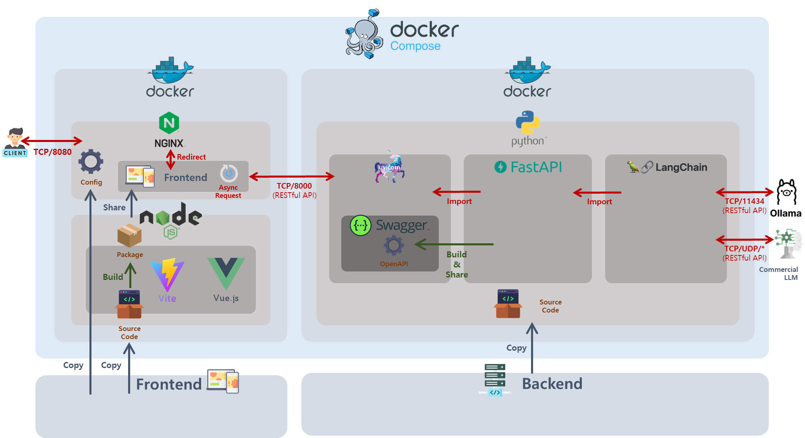

# Fullstack Risk Assessment Service

본 프로젝트는 **건설 현장 위험성 평가 시스템**을 위한 Fullstack 웹 애플리케이션입니다. 전체 시스템은 Docker Compose를 통해 다음과 같이 구성되어 있습니다.



## 📦 시스템 구성

### 1. Frontend
- **Framework:** [Vite](https://vitejs.dev/), [Vue.js](https://vuejs.org/)
- **Build Tool:** Node.js
- **Serving:** NGINX (포트 8080)
- **역할:** 클라이언트 요청을 비동기로 처리하고, REST API를 통해 백엔드와 통신

**프로세스**
```bash
# Vite + Vue.js 기반 프론트엔드 소스 코드 작성
# ↓
# Node.js로 빌드 및 패키징
# ↓
# NGINX에서 정적 파일 제공 (포트 8080)
```

### 2. Backend
- **Framework:** FastAPI (Python)
- **Serving:** Uvicorn (포트 8000)
- **API 문서화:** Swagger (OpenAPI)
- **확장 모듈:** LangChain

**주요 기능**
- RESTful API 처리
- LangChain을 통한 LLM 연동
- 외부 LLM 서버와 통신 (Ollama, 상용 LLM)

### 3. LLM 연동
- **지원 모델:** 
  - Ollama (포트 11434)
  - Commercial LLM API (다양한 TCP/UDP 포트)

## 🔄 서비스 흐름

1. **클라이언트**가 `http://localhost:8080`으로 접속
2. **NGINX**가 정적 프론트엔드 파일을 제공
3. **프론트엔드**가 REST API 요청 (`TCP/8000`)을 **FastAPI** 백엔드로 전달
4. **FastAPI**는 내부적으로 **LangChain**을 통해 LLM을 호출 (`TCP/11434`, 기타 포트)
5. 결과를 다시 프론트엔드로 비동기 응답

## 🐳 Docker 구성

**Docker Compose로 전체 시스템을 오케스트레이션**

- Frontend:
  - `nginx` + `node:alpine`
- Backend:
  - `python:3.12` + `uvicorn`
- 외부 서비스:
  - `ollama` 또는 기타 상용 LLM
  - 기타 Robust LLM (i.g., GPT-4o)

## 🚀 시작 방법

```bash
# 전체 서비스 빌드 및 실행
docker-compose up --build
```

## 📚 API 문서 확인

API 문서는 자동으로 Swagger UI로 생성됩니다.

- 접속: [http://localhost:8000/docs](http://localhost:8000/docs)