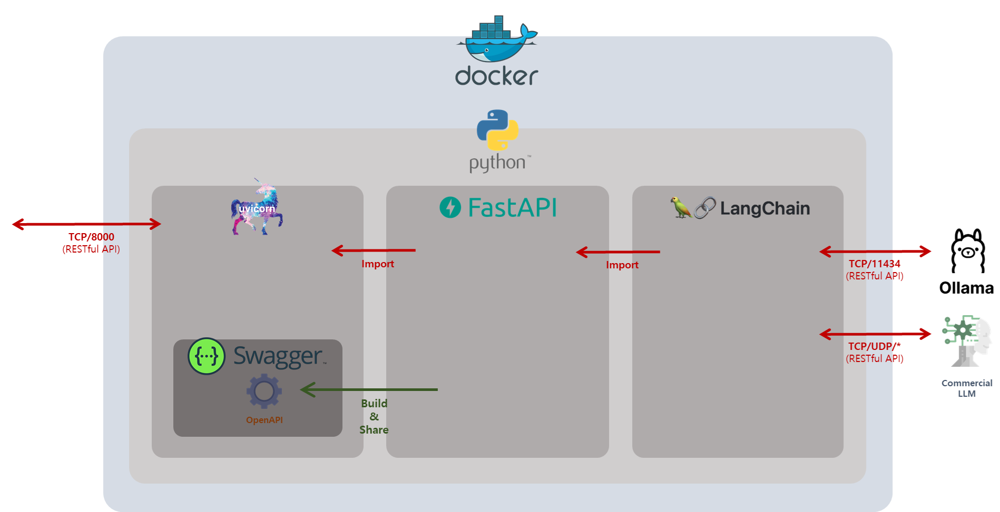

# Backend



## 1. Chains

### 1.1. Run individual chain
```bash
cd backend
python -m "chains.<파일 이름>"
```
> ⚠️ Don't forget `if __name__ == "__main__": <Your Chain Instant>`.

### 1.2. Chain 규칙
1. prompt는 `"prompts.yaml"`에 저장한다.
2. RAG 대상이 되는 파일 및 db는 `"assets"`에서 관리한다.
3. Output structure는 `"structures"`에서 관리한다. 이때, `pydantic`을 사용하는 것을 권장합니다.
4. Module화

    아래와 같이 instant 형태로 주세요. 추가적으로, 모듈을 새로운 파일에 만들었을 경우 `__init__.py`에 추가해주세요.
    ```python
    ...
    chain = Runnable() | prompt | llm

    __all__ = ["chain"]
    ```

## Written by

- @pikaybh